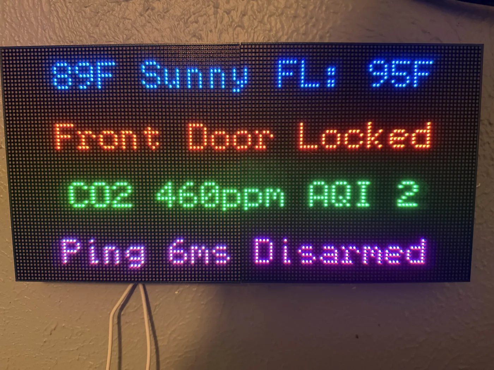

---
hide:
  - navigation
  - toc
---

# Classes

Free, hands-on classes I teach at the [Dallas Makerspace](https://dallasmakerspace.org), published here for anyone. Read them online, download the print versions, or fork the repo and teach your own.

-   { .card-photo }

    :material-home-assistant:{ .class-icon .c-ha } **Intro to Home Assistant**

    ---

    Smart homes done the right way: every device in one local app, no cloud lock-in. From "what is this?" to live automations in about 2.5 hours.

    [Go to the class](intro-to-home-assistant/index.md){ .md-button .md-button--primary }

## Coming soon

-   :material-chip:{ .class-icon .c-esphome } **ESPHome**

    ---

    Turn cheap ESP32 boards into your own sensors and devices with simple YAML.

-   :material-led-strip-variant:{ .class-icon .c-wled } **Low-Voltage LED Lighting with WLED**

    ---

    Addressable LED strips and controllers running WLED firmware: planning, power, and effects.

-   :material-soldering-iron:{ .class-icon .c-solder } **Soldering**

    ---

    Iron technique, clean joints, and your first kit build.

Everything here is plain Markdown in a [public repo](https://github.com/bharvey88/classes), licensed [CC BY 4.0](https://github.com/bharvey88/classes/blob/main/LICENSE). Fork it, swap in your own gear and stories, and teach it at your makerspace or library.

*By Brandon Harvey (SmartHomeSellout) · [smarthomesellout.com](https://smarthomesellout.com)*
