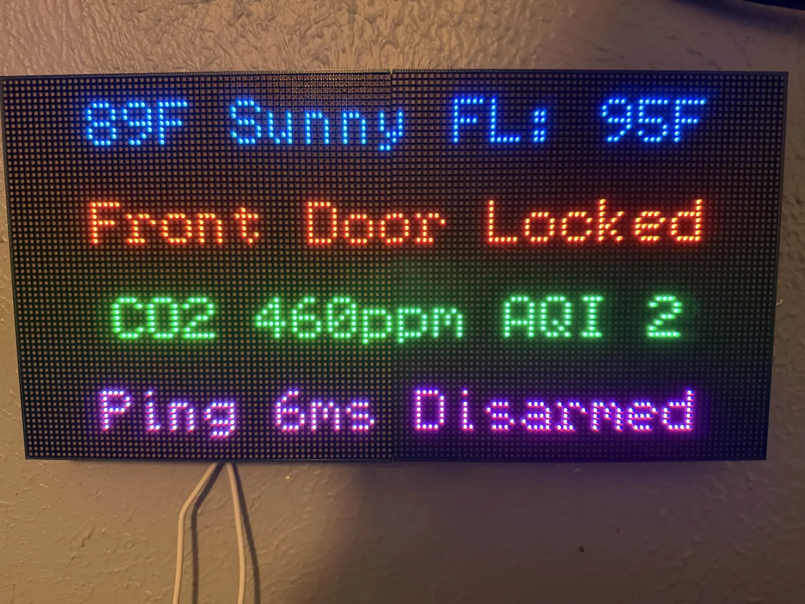

---
hide:
  - navigation
  - toc
---

# Classes

Free, hands-on classes I teach live at the [Dallas Makerspace](https://dallasmakerspace.org). Follow along in class, keep the handout, or [fork a class](teaching.md) and teach it at your own space.

## :material-home-assistant:{ .class-icon .c-ha } Intro to Home Assistant

Every smart device in one app that runs in your own house instead of a vendor's cloud. Two hours, live demos, zero background needed.

[Go to the class](intro-to-home-assistant/index.md){ .md-button .md-button--primary }

## Coming soon

-   :material-chip:{ .class-icon .c-esphome } **ESPHome**

    ---

    Turn cheap ESP32 boards into your own sensors and devices with simple YAML.

-   :material-led-strip-variant:{ .class-icon .c-wled } **Low-Voltage LED Lighting with WLED**

    ---

    Addressable LED strips and controllers running WLED firmware: planning, power, and effects.

-   :material-soldering-iron:{ .class-icon .c-solder } **Soldering**

    ---

    Iron technique, clean joints, and your first kit build.

Everything is [CC BY 4.0](https://github.com/bharvey88/classes/blob/main/LICENSE). Want to run one of these at your own makerspace or library? [Teach these classes](teaching.md).

*By Brandon Harvey (SmartHomeSellout) · [smarthomesellout.com](https://smarthomesellout.com)*
