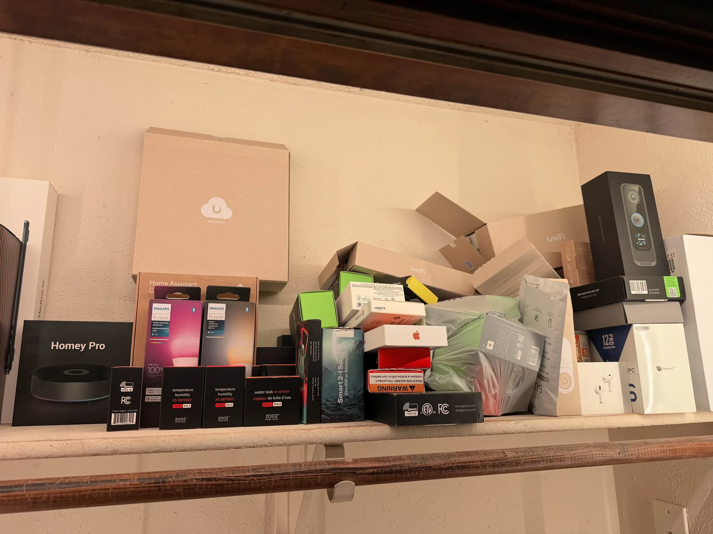
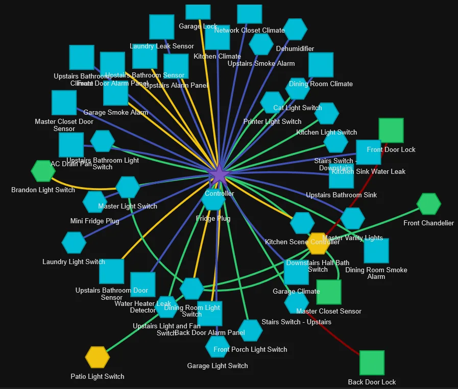

# Intro to Home Assistant

*Smart Homes Done the Right Way*

A class by **Brandon Harvey** (SmartHomeSellout) · [smarthomesellout.com](https://smarthomesellout.com), first taught at the [Dallas Makerspace](https://dallasmakerspace.org).

{ .page-hero }

In one evening you'll go from "what is Home Assistant?" to knowing what to buy, what to skip, and how to make your house do the work. Free, about two hours, taught live with demos from my own house.

Home Assistant is the middleman that connects all your smart devices and protocols (Zigbee, Z-Wave, Wi-Fi, Bluetooth) into one local app. No ten vendor apps, no cloud lock-in: your data stays yours.

## What we cover

- What Home Assistant is, and why people use it instead of ten different vendor apps
- What to run it on, including hardware you might already own
- How smart devices talk to each other, and which kinds to buy for lights, locks, and sensors
- A live walkthrough: dashboards, the phone app, and building your first automation
- The payoff: a house that locks up when you leave and tells you when the mail arrives
- Where to go next: building your own sensors, voice control, and letting AI do the hard or tedious parts

For complete beginners. No programming background needed.

[Speaker outline](outline.md){ .md-button .md-button--primary }
[Attendee handout](handout.md){ .md-button }

## Downloads

- [Speaker outline (PDF)](https://github.com/bharvey88/classes/releases/download/intro-ha/Intro-to-HA-Speaker-Outline.pdf) · [docx](https://github.com/bharvey88/classes/releases/download/intro-ha/Intro-to-HA-Speaker-Outline.docx)
- [Attendee handout (PDF)](https://github.com/bharvey88/classes/releases/download/intro-ha/Intro-to-HA-Attendee-Handout.pdf) · [docx](https://github.com/bharvey88/classes/releases/download/intro-ha/Intro-to-HA-Attendee-Handout.docx)

## My Z-Wave mesh

{ .page-figure }

*Locks, sensors, and switches across the house, one controller. The class covers how a mesh like this gets built, one device at a time.*

---

Want to run this class at your own makerspace? [Teach these classes](../teaching.md). Content is [CC BY 4.0](https://github.com/bharvey88/classes/blob/main/LICENSE).
