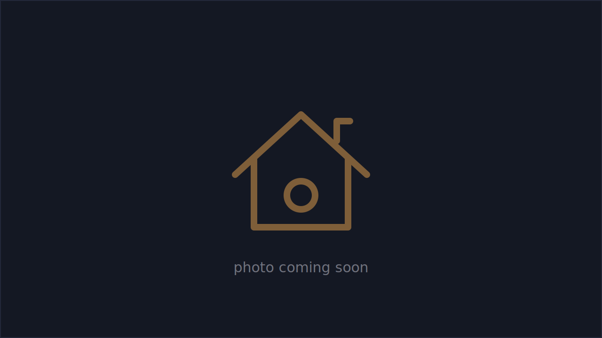

# Intro to Home Assistant

*Smart Homes Done the Right Way*

A class by **Brandon Harvey** (aka SmartHomeSellout) · [smarthomesellout.com](https://smarthomesellout.com), first taught at the [Dallas Makerspace](https://dallasmakerspace.org).

{ .page-hero }

Home Assistant is the middleman that connects all your smart devices and protocols (Zigbee, Z-Wave, Wi-Fi, Bluetooth) into one local app. No ten vendor apps, no cloud lock-in: your data stays yours. Over about 2.5 hours the class goes from "what is this?" to running automations, choosing protocols and gear, and letting an AI agent build your dashboards.

[Speaker outline](outline.md){ .md-button .md-button--primary }
[Attendee handout](handout.md){ .md-button }

## Download the print versions

Built automatically from the same Markdown on every change:

- [Speaker outline (PDF)](https://github.com/bharvey88/classes/releases/download/intro-ha/Intro-to-HA-Speaker-Outline.pdf) · [docx](https://github.com/bharvey88/classes/releases/download/intro-ha/Intro-to-HA-Speaker-Outline.docx)
- [Attendee handout (PDF)](https://github.com/bharvey88/classes/releases/download/intro-ha/Intro-to-HA-Attendee-Handout.pdf) · [docx](https://github.com/bharvey88/classes/releases/download/intro-ha/Intro-to-HA-Attendee-Handout.docx)

## Teach it yourself

1. [Fork the repo](https://github.com/bharvey88/classes/fork).
2. Edit the Markdown in `docs/intro-to-home-assistant/` to swap in your own gear, stories, and demos.
3. Push, and the site and documents rebuild automatically.

Content is licensed [CC BY 4.0](https://github.com/bharvey88/classes/blob/main/LICENSE): use it, remix it, teach with it.
