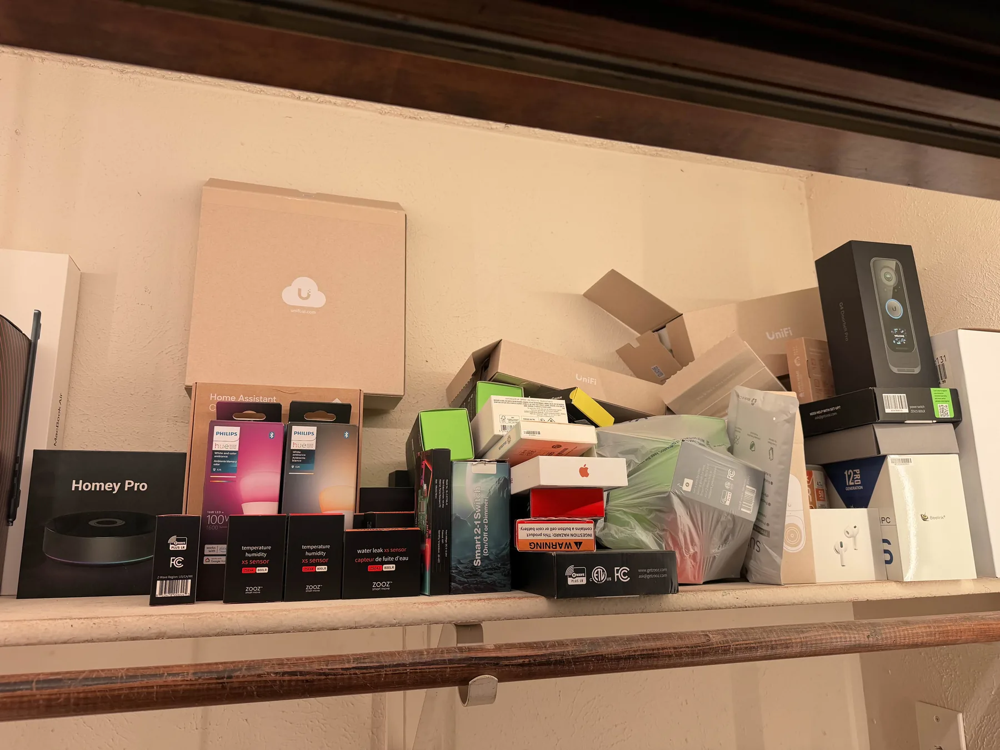
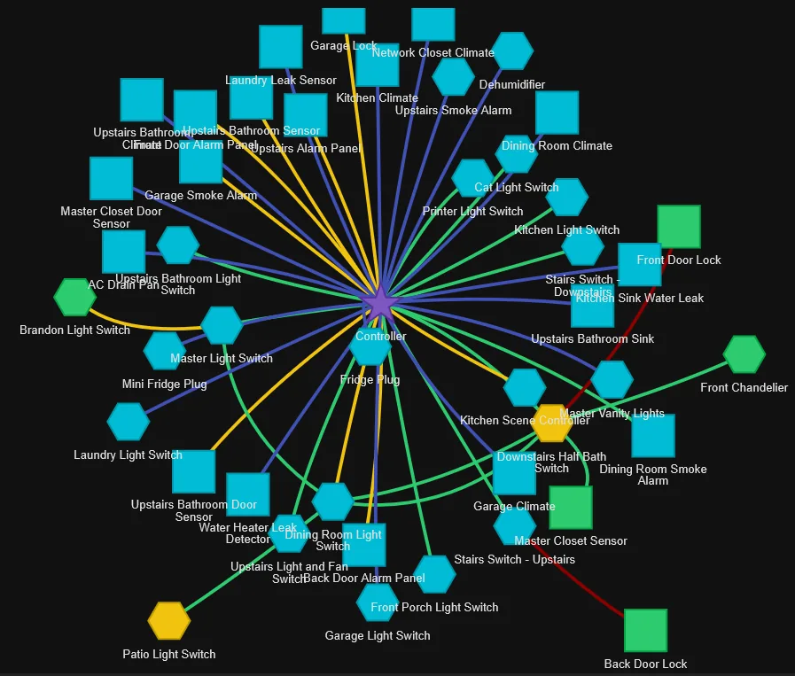

# Intro to Home Assistant

A class by **Brandon Harvey** (SmartHomeSellout) · [smarthomesellout.com](https://smarthomesellout.com), first taught at the [Dallas Makerspace](https://dallasmakerspace.org).

{ .page-hero }

A free two-hour class with live demos from my own house. We start at zero and end with you knowing enough to set up your own system without wasting money on the wrong gear.

Home Assistant is the middleman that connects your smart devices and protocols (Zigbee, Z-Wave, Wi-Fi, Bluetooth) into one app that runs in your own house, not in a vendor's cloud.

## What we cover

- What Home Assistant is, and why people use it instead of ten different vendor apps
- What to run it on, including hardware you might already own
- How smart devices talk to each other, and which kinds to buy for lights, locks, and sensors
- A live walkthrough: dashboards, the phone app, and building your first automation
- The payoff: a house that locks up when you leave and tells you when the mail arrives
- Where to go next: building your own sensors, voice control, and letting AI do the hard or tedious parts

{ .page-figure }

*From my house: locks, sensors, and switches meshed through one Z-Wave controller. The class covers how a map like this gets built, one device at a time.*

For complete beginners. No programming background needed.

## The materials

The **attendee handout** is the take-home guide: the gear I recommend, a protocol cheat sheet, and links to everything mentioned in class. If you took the class, this is your page. Sitting in the class right now without a printed copy? Open it on your phone and follow along, no note-taking needed.

The **speaker outline** is the full script of the class: every block, the timing, and the talking points. Read it if you're curious what gets covered, or if you want to [teach this class yourself](../teaching.md).

[Attendee handout](handout.md){ .md-button .md-button--primary }
[Speaker outline](outline.md){ .md-button }

## Downloads

- [Speaker outline (PDF)](https://github.com/bharvey88/classes/releases/download/intro-ha/Intro-to-HA-Speaker-Outline.pdf) · [docx](https://github.com/bharvey88/classes/releases/download/intro-ha/Intro-to-HA-Speaker-Outline.docx)
- [Attendee handout (PDF)](https://github.com/bharvey88/classes/releases/download/intro-ha/Intro-to-HA-Attendee-Handout.pdf) · [docx](https://github.com/bharvey88/classes/releases/download/intro-ha/Intro-to-HA-Attendee-Handout.docx)

---

Want to run this class at your own makerspace? [Teach these classes](../teaching.md). Content is [CC BY 4.0](https://github.com/bharvey88/classes/blob/main/LICENSE).
